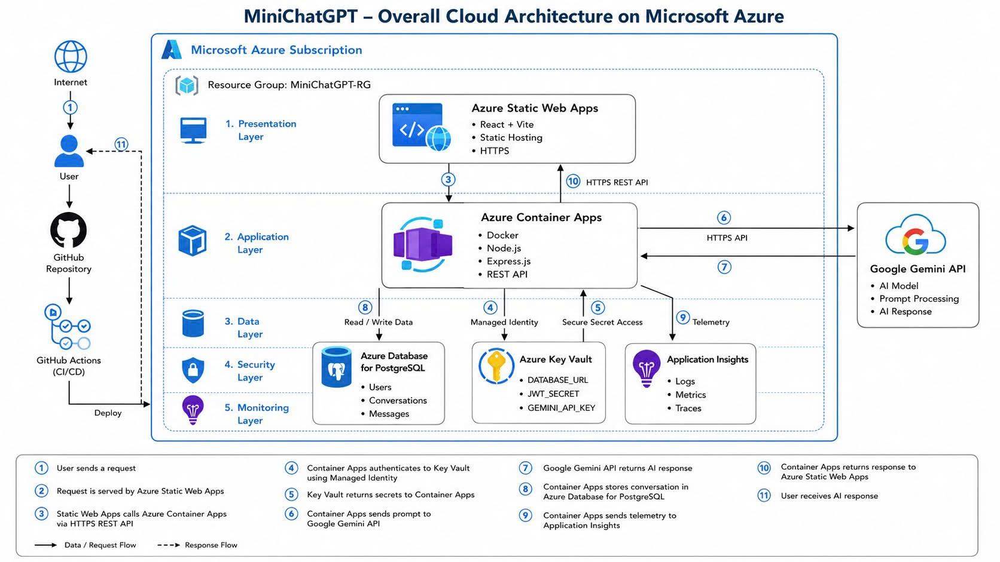

# 🤖 MiniChatGPT

<p align="center">

An AI-powered Full-stack Chat Application with secure authentication, persistent chat history, and intelligent conversations powered by Google Gemini API.

Built with **React**, **Node.js**, **PostgreSQL**, and deployed on **Microsoft Azure** using **GitHub Actions CI/CD**.

</p>

<p align="center">

<a href="https://purple-grass-0b3fec600.7.azurestaticapps.net/">

</a>

<a href="https://github.com/vuth9808/MiniChatGPT_Main">

</a>


</p>

---

# 📸 Preview

## 💬 Chat

<p align="center">


</p>

---

## 🛠 Admin Dashboard

<p align="center">


</p>

---

## 📱 Mobile

<p align="center">


</p>

---

# ✨ Features

- 🤖 AI-powered conversations using Google Gemini API
- 🔐 Secure JWT Authentication
- 💬 Persistent Conversation History
- 👤 User & Admin Dashboard
- 🛡 Role-Based Authorization
- ☁ Cloud-native deployment on Microsoft Azure
- ⚙ Automated CI/CD with GitHub Actions
- 📱 Fully Responsive Design
- 🌙 Dark / Light Theme
- ⚡ Smart Error Handling & Rate Limiting

---

# 🏗 System Architecture

The application follows a cloud-native architecture on Microsoft Azure with automated CI/CD using GitHub Actions.

<p align="center">
  
</p>

---

### Architecture Overview

- React + Vite frontend hosted on Azure Static Web Apps.
- Node.js + Express backend deployed on Azure Container Apps.
- Azure Database for PostgreSQL stores users, conversations, and messages.
- Azure Key Vault securely manages application secrets.
- Application Insights collects logs and telemetry.
- Google Gemini API provides AI-powered responses.
- GitHub Actions automates CI/CD deployments.

---

# 🛠 Tech Stack

### Frontend

<p>


</p>

---

### Backend

<p>


</p>

---

### Database

<p>


</p>

---

### Cloud & DevOps

<p>


</p>

---

### AI

<p>


</p>

---

# 📂 Project Structure

```text
MiniChatGPT
│
├── frontend/
│   ├── src/
│   ├── public/
│   └── package.json
│
├── backend/
│   ├── src/
│   ├── package.json
│   └── Dockerfile
│
├── database/
│   └── mini_chatgpt.sql
│
├── .github/
│   └── workflows/
│
└── README.md
```

---

# ⚙ Environment Variables

## Backend

```env
DATABASE_URL=

JWT_SECRET=

GEMINI_API_KEY=

GEMINI_MODEL=

CLIENT_ORIGIN=

NODE_ENV=production
```

---

## Frontend

```env
VITE_API_BASE_URL=
```

---

# 🚀 Getting Started

## Clone Repository

```bash
git clone https://github.com/vuth9808/MiniChatGPT_Main.git
```

---

## Backend

```bash
cd backend

npm install

npm run dev
```

---

## Frontend

```bash
cd frontend

npm install

npm run dev
```

---

# 📡 REST API

## Authentication

| Method | Endpoint |
|----------|----------|
| POST | /register |
| POST | /login |
| POST | /logout |

---

## Conversations

| Method | Endpoint |
|----------|----------|
| GET | /conversations |
| POST | /conversations |
| GET | /conversations/:id |
| DELETE | /conversations/:id |
| POST | /conversations/:id/messages |

---

## Admin

| Method | Endpoint |
|----------|----------|
| GET | /users |
| DELETE | /users/:id |

---

# 🔒 Security

- JWT Authentication
- Password Hashing with bcrypt
- Parameterized SQL Queries
- Role-Based Authorization
- CORS Protection
- Rate Limiting
- Secure Cookies

---

# 🚀 Deployment

The application is automatically deployed through **GitHub Actions**.

```text
GitHub
      │
      ▼
GitHub Actions
      │
 ┌────┴────┐
 ▼         ▼
Azure Static Web Apps
Azure Container Apps
      │
      ▼
Azure Database for PostgreSQL
```

Every push to the main branch automatically triggers the deployment pipeline.

---

# 📄 License

This project is licensed under the MIT License.

---

# 👨‍💻 Author

**To Hoang Vu**

📧 tohoangvu161225@gmail.com

🌐 https://github.com/vuth9808
