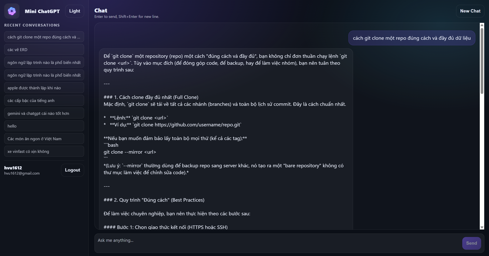
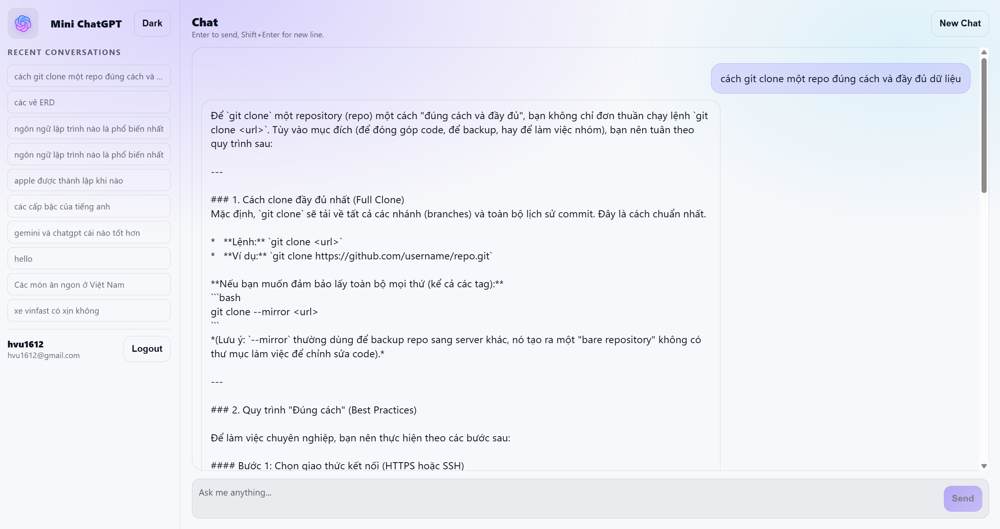
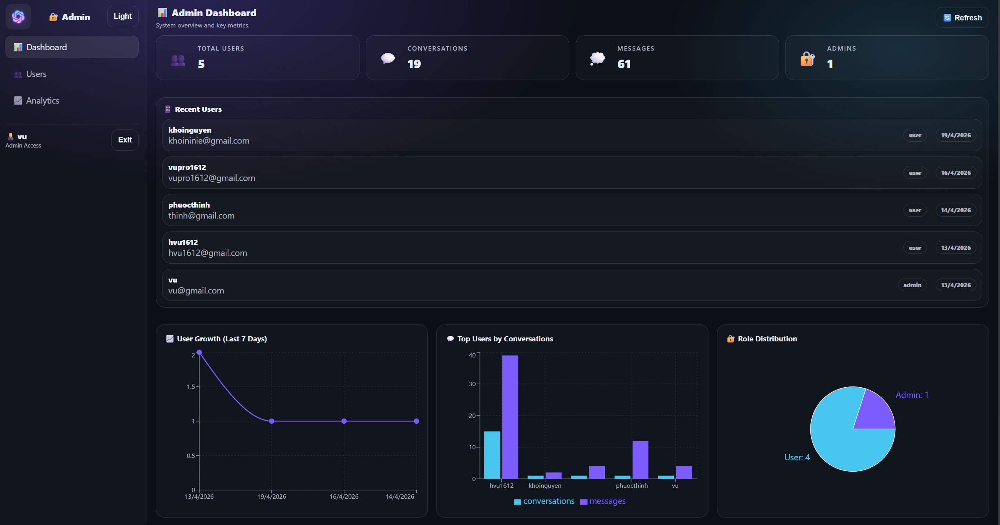
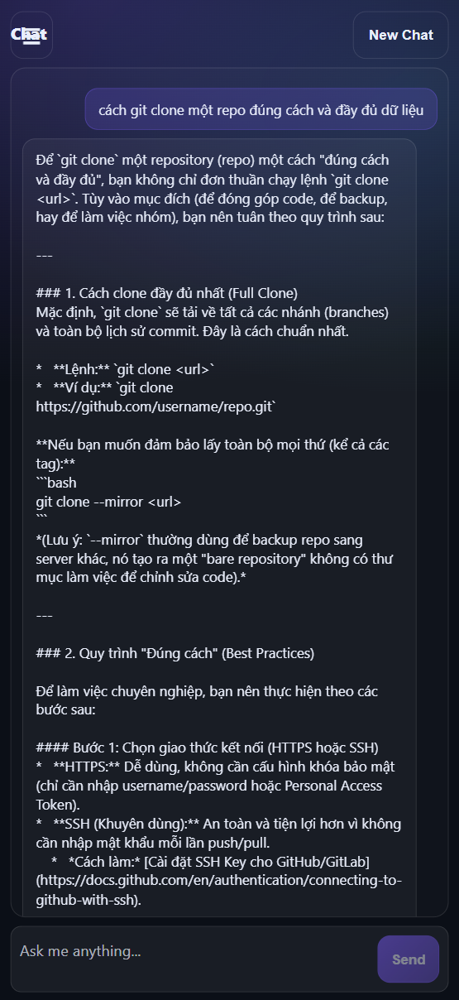
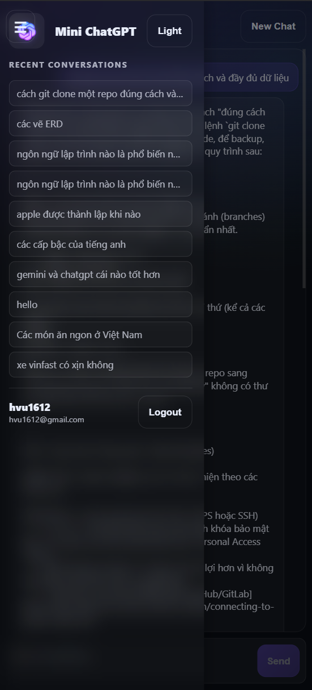

# 🚀 MiniChatGPT - AI Chat Application

A production-ready fullstack web application for AI-powered conversations with user authentication, chat history management, and admin dashboard.

**Tech Stack:** 
- 🎨 Frontend: React + Vite | Vercel
- 🖥️ Backend: Node.js + Express | Render
- 💾 Database: PostgreSQL | Supabase
- 🤖 AI: Google Generative AI (Gemini)

---

## ✨ Features

### Core Chat Features
- 💬 **Real-time AI Chat** - Powered by Google Gemini API
- 📝 **Conversation History** - Save and manage chat conversations
- 🔄 **Smart Error Handling** - Automatic retry logic for failures
- ⚠️ **Quota Management** - Graceful handling of API quotas
- 🎯 **Message Caching** - Reduce API calls with smart caching

### User Management
- 🔐 **Secure Authentication** - JWT-based with bcrypt
- 👤 **User Profiles** - Register, login, logout
- 🛡️ **Role-Based Access** - Admin and user roles
- 📊 **User Statistics** - Activity dashboard

### Admin Features
- 👥 **User Management** - View and manage users
- 📈 **Usage Analytics** - Track API usage
- 🔍 **Conversation Browsing** - View user chats
- ⚙️ **System Monitoring** - Health checks and logs

### User Experience
- 📱 **Fully Responsive** - Works on all devices
- 🎨 **Dark/Light Theme** - Theme toggle
- ⌨️ **Keyboard Shortcuts** - Enter to send
- 🎯 **Sidebar Navigation** - Quick access
- ♿ **Accessible UI** - WCAG-compliant

---

## 📷 Screenshots

### 💬 Chat

<p align="center">
  
  
</p>

---

### 🛠️ Admin Dashboard

<p align="center">
  
</p>

---

### 📱 Mobile

<p align="center">
  
  
</p>

---

### 💰 Cost Estimate

```
Supabase (Database):  $0/month (free tier)
Render (Backend):     $0/month (free tier, sleeps after 15min)
Vercel (Frontend):    $0/month (free tier, unlimited)
────────────────────────────────────
TOTAL:                $0/month ✅
```

Upgrade only when needed for better performance.

---

## 🏗️ Project Structure

```
MiniChatGPT/
│   ├── src/
│   │   ├── pages/              # Page components (Chat, Login, History, Admin)
│   │   ├── components/         # Reusable components (AppShell, Auth, etc)
│   │   ├── state/              # React context (auth, theme)
│   │   ├── utils/              # Utilities (error classifier, caching, etc)
│   │   ├── api/                # API client configuration
│   │   ├── App.jsx
│   │   └── styles.css          # Responsive design (mobile-first)
│   ├── index.html
│   ├── vite.config.js
│   └── package.json
│
├── backend/                     # Node.js + Express API
│   ├── src/
│   │   ├── routes/             # API endpoints (auth, chat, conversations)
│   │   ├── middleware/         # Auth, error handling, logging
│   │   ├── utils/              # Gemini API, error handler, caching, rate limiter
│   │   ├── app.js              # Express app setup
│   │   ├── server.js           # Server entry point
│   │   └── db.js               # Database connection
│   ├── .env.example
│   └── package.json
│
├── database/
│   └── mini_chatgpt.sql        # PostgreSQL schema
│
│
└── README.md                    # This file
```

---

### 🔧 Environment Variables

Before deployment, create these environment files:

**Backend** (`backend/.env`):
```env
DB_HOST=your-supabase-host.supabase.co
DB_PORT=5432
DB_USER=postgres
DB_PASSWORD=your-password
DB_NAME=postgres
JWT_SECRET=your-random-secret-32-chars
GEMINI_API_KEY=your-google-api-key
GEMINI_MODEL=gemini-pro
NODE_ENV=production
CLIENT_ORIGIN=https://your-frontend.vercel.app
```

**Frontend** (`frontend/.env.production`):
```env
VITE_API_BASE_URL=https://your-backend.onrender.com
```

---

## 🚀 Quick Start

### Prerequisites
- **Node.js** 16+ (LTS recommended)
- **PostgreSQL** 13+ (local or remote)
- **Google API Key** for Gemini API

### 1️⃣ Database Setup

```bash
# Create database
psql -U postgres -c "CREATE DATABASE mini_chatgpt;"

# Import database
psql -U postgres -d mini_chatgpt -f database/mini_chatgpt.sql

# Make yourself admin (optional)
psql -U postgres -d mini_chatgpt -c "UPDATE users SET role='admin' WHERE email='your_email@example.com';"
```

### 2️⃣ Backend Setup

```bash
cd backend

# Copy and configure environment
cp .env.example .env
# Edit .env with your values:
# - DB_HOST, DB_USER, DB_PASSWORD, DB_NAME
# - JWT_SECRET (generate a random string)
# - GEMINI_API_KEY (from Google AI Studio)
# - CLIENT_ORIGIN=http://localhost:5173

# Install and run
npm install
npm run dev
```

Backend runs at `http://localhost:5000`

### 3️⃣ Frontend Setup

```bash
cd frontend

# Copy environment (optional - uses defaults)
cp .env.example .env

# Install and run
npm install
npm run dev
```

Frontend runs at `http://localhost:5173`

---

## 📚 API Documentation

### Authentication Endpoints

| Method | Endpoint | Description |
|--------|----------|-------------|
| `POST` | `/register` | Register new user |
| `POST` | `/login` | Login user |
| `POST` | `/logout` | Clear session |

### Conversation Endpoints

| Method | Endpoint | Description |
|--------|----------|-------------|
| `GET` | `/conversations` | Get all user conversations |
| `POST` | `/conversations` | Create new conversation |
| `GET` | `/conversations/:id` | Get conversation with messages |
| `DELETE` | `/conversations/:id` | Delete conversation |
| `POST` | `/conversations/:id/messages` | Send message to conversation |

### Admin Endpoints

| Method | Endpoint | Description |
|--------|----------|-------------|
| `GET` | `/users` | Get all users (admin only) |
| `DELETE` | `/users/:id` | Delete user (admin only) |

---

## 🔐 Security

- ✅ **Password Hashing**: bcryptjs with salt rounds
- ✅ **JWT Tokens**: Secure, HttpOnly cookies
- ✅ **SQL Injection Prevention**: Parameterized queries
- ✅ **CORS Protection**: Whitelist allowed origins
- ✅ **Rate Limiting**: Per-user request throttling
- ✅ **XSS Protection**: React's built-in escaping
- ✅ **CSRF Protection**: SameSite cookie flag

---

## 🧪 Testing Checklist

- [ ] Register new user
- [ ] Login with correct/incorrect credentials
- [ ] Send message and receive AI response
- [ ] Save conversation to history
- [ ] Load previous conversation
- [ ] Delete conversation
- [ ] View admin dashboard
- [ ] Delete user (admin only)
- [ ] Toggle dark/light theme
- [ ] Test on mobile device (responsive)
- [ ] Test with quota exhausted (should block sends)

---

## 📝 License

MIT License - see LICENSE file for details

---

## 🎉 Thank You!

Built with ❤️ using React, Node.js, and Google Gemini API

**Status**: ✅ Production Ready | Built: April 2026
